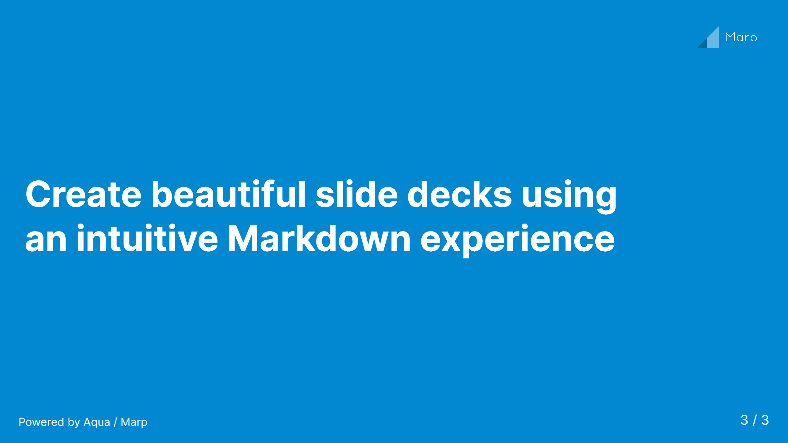

# Aqua: A Simple and Elegant [Marp](https://marp.app/) Theme

The CSS Source: [aqua.css](./aqua.css)

## Demo

- Input markdown: [sample.md](./sample.md)
- Output pdf: [sample.pdf](./sample.pdf)

## Acknowledgement

This theme has been created by modifying and adding code to the theme
[`gradient`](https://rnd195.github.io/marp-community-themes/theme/gradient.html).

- Big thanks to the author.

The primary color (blue) of this theme is picked up from the
[Marp's public blog page](https://marp.app/blog).

- And also the logo.
- Big thanks to the creater of Marp and those who contribute to the eco-system.
